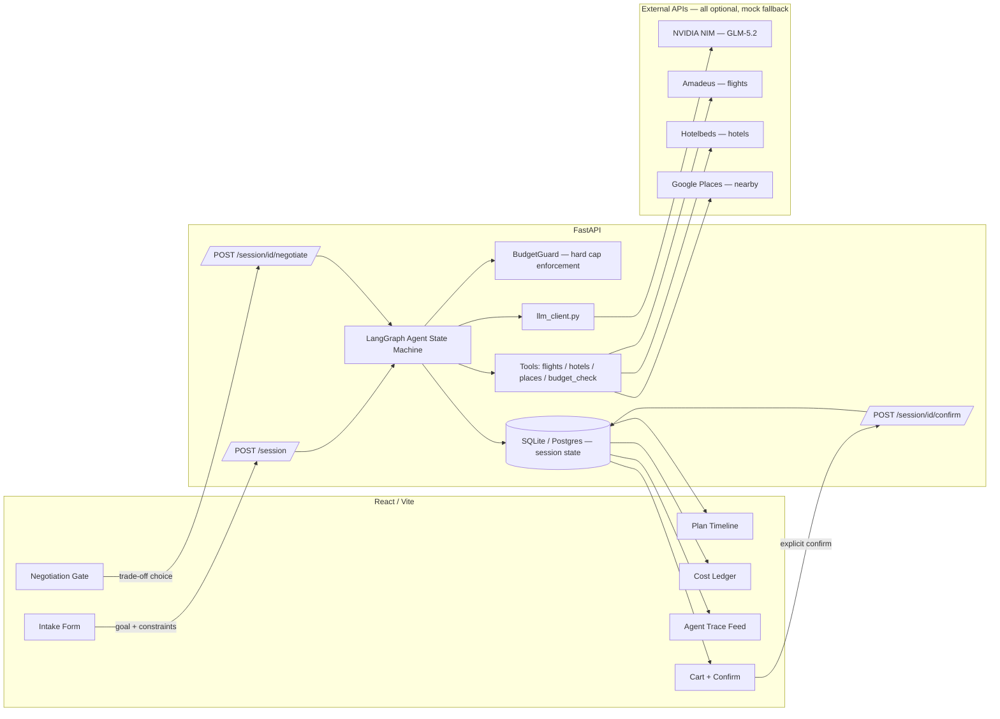
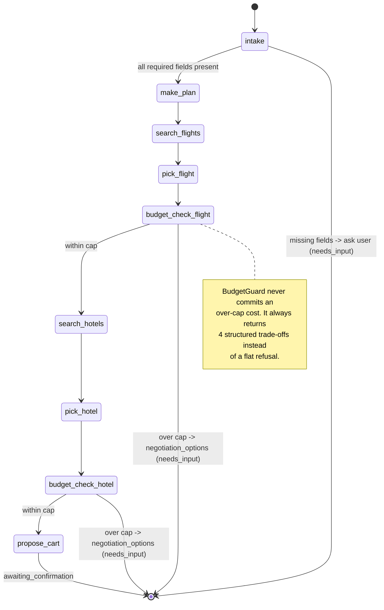

# PROJECT.md — Waypoint: Agentic Travel Concierge

> Read this file first — before touching code. It's written so a new
> teammate *or* another AI assistant picking up this repo cold can
> understand the thesis, the architecture, and what to build next without
> asking anyone a question.

---

## 1. The one-sentence thesis

Most AI travel tools compete on **prettier itineraries**. We compete on
**trust**: an agent that shows its plan before acting, calls real tools,
and is *structurally incapable* of spending past a budget cap you set —
because the guardrail is enforced in code (`budget_guard.py`), not by
asking the model nicely.

Only ~8% of travelers currently trust AI to book on their behalf. That
number is the market gap. Every feature in this repo either (a) builds
trust, or (b) doesn't ship.

---

## 2. What's already built (Week 1 scaffold — working end to end)

- [x] FastAPI backend with a LangGraph state machine agent
- [x] NVIDIA NIM integration (OpenAI-compatible), swappable provider
- [x] Mock flight/hotel/places tools with a clean real-API swap point
- [x] Hard budget cap enforcement (`BudgetGuard`) — cost is never committed
      if it would exceed the cap; a structured negotiation is offered instead
- [x] Visible plan-before-act (`plan_steps`, rendered as a timeline)
- [x] Live agent trace (reasoning / tool calls / tool results / decisions)
- [x] Resumable session state (SQLite-backed, swappable to Postgres)
- [x] Confirmation gate before any "booking" (mocked, ready for a real
      payment provider to be wired in behind one endpoint)
- [x] React frontend: intake form → plan timeline → live cost ledger →
      agent trace feed → negotiation gate → cart confirm
- [x] Unit tests for the budget guard (the trust-critical path)

Run it: see `SETUP.md`.

---

## 3. System architecture



---

## 4. The agent's state machine (the actual "brain")



**Resuming after negotiation:** `POST /session/{id}/negotiate` mutates the
stored state (raise cap / approve overage / drop the item) and re-invokes
the *same* graph from a clean `intake` pass, which re-uses whatever's
already chosen and re-runs only what's needed. This is what makes sessions
resumable rather than restart-from-scratch.

---

## 5. Feature inventory — status + owner slot

Use this table as the single source of truth for planning. Mark status as
you go: `todo` / `in-progress` / `done`. Fill in `owner` per teammate.

| # | Feature | Category | Status | Owner | Notes |
|---|---|---|---|---|---|
| 1 | Plan-before-act timeline | Core trust | done | | `PlanTimeline.jsx` |
| 2 | Real tool calls (flight/hotel search + budget check) | Core trust | done | | mock data, real-API swap ready |
| 3 | Hard spend cap enforcement | Core trust | done | | `budget_guard.py` |
| 4 | Confirmation gate before booking | Core trust | done | | booking itself mocked |
| 5 | Failure → re-plan / negotiation | Core trust | done | | `NegotiationGate.jsx` |
| 6 | Resumable session state | Core trust | done | | SQLite now, Postgres later |
| 7 | Live cost ledger UI | Differentiator | done | | `CostLedger.jsx` |
| 8 | Confidence-scored recommendations | Differentiator | done | | `ConfidenceBadge.jsx`, model self-reports confidence |
| 9 | Negotiation instead of flat refusal | Differentiator | done | | 4 structured trade-offs |
| 10 | Explainable decision/refusal audit log | Differentiator | partial | | `BudgetGuard.audit_trail()` exists; not yet exposed as its own UI panel |
| 11 | Live "agent thinking" trace stream | Demo polish | done | | `AgentTraceFeed.jsx`, currently polling not streaming |
| 12 | Real flight data (Amadeus) | Data depth | todo | | flip `AMADEUS_CLIENT_ID/SECRET` in `.env` |
| 13 | Real hotel data (Hotelbeds) | Data depth | todo | | needs signed-request auth implemented |
| 14 | Real nearby places (Google Places) | Data depth | todo | | stub exists in `tools.py` |
| 15 | Constraint-solver re-planning (OR-Tools) | Deep differentiator | todo | | replaces heuristic "cheapest first" picks with real optimization |
| 16 | Preference memory across sessions | Deep differentiator | todo | | needs a `users` table + embedding or simple trait store |
| 17 | Group budget splitting | Product | todo | | per-traveler sub-caps inside one session |
| 18 | Proactive monitoring / rebooking agent | Product | todo | | background worker (Celery/APScheduler) polling for price drops |
| 19 | Configurable policy engine | B2B story | todo | | admin-settable rules beyond budget (e.g. "no red-eyes") |
| 20 | Buyer/seller negotiation agent | Deep differentiator | todo | | second LLM role playing the "supplier" |
| 21 | Voice narration (TTS) of the plan | Demo polish | todo | | one API call (ElevenLabs / OpenAI TTS / browser SpeechSynthesis for free) |
| 22 | Real payment (Stripe/Razorpay) behind confirm gate | Production readiness | todo | | wire only inside `routes_session.py::confirm_booking` |
| 23 | Auth + multi-user accounts | Production readiness | todo | | needed before preference memory makes sense |
| 24 | Mobile-responsive layout | Polish | todo | | current CSS grid breaks below ~700px, needs a stacked layout |
| 25 | Multi-agent transparency view (flowchart of live handoffs) | Deep differentiator | todo | | only worth it if we go multi-agent (flight-agent/hotel-agent/budget-agent split) |

---

## 6. Four-week build plan (see chat history for full detail — summarized here)

- **Week 1 (done — this scaffold):** foundation. NIM + LangGraph wired,
  mock tools, hard budget cap, plan UI, trace UI, negotiation UI.
- **Week 2:** real flight/hotel API (#12–13), audit-log panel (#10),
  polish the negotiation → re-plan loop until it's demo-proof.
- **Week 3:** differentiators — constraint-solver re-planning (#15),
  preference memory (#16), group budget splitting (#17). Start open-sourcing
  `budget_guard.py` + `graph.py` as a standalone "safe agent" pattern repo.
- **Week 4:** proactive monitoring (#18), policy engine (#19), auth (#23),
  mobile polish (#24), record a backup demo video, rehearse the live demo
  path (intake → over-budget hotel → negotiate → confirm) until it's boring.

---

## 7. Design system (for anyone touching the frontend)

Aesthetic: **flight log / control tower**, not a generic chat app — the
product's thesis is "watch the instruments," so the UI should feel like
telemetry, not marketing.

- Background: deep instrument-panel navy (`--ink #0E1420`)
- Accent (the *only* accent — used for anything "live"): amber (`--signal #E8A33D`)
- Confirmed/allowed: green (`--go #5FBF8F`) · Blocked/over-budget: red (`--stop #E2665C`)
- Display type: Fraunces (headers only, used sparingly)
- Data/numbers/trace: IBM Plex Mono — the ledger and trace feed should
  always look like a readout, never like prose
- Full tokens: `frontend/src/styles/global.css`

**Rule for new components:** if you're about to add a second bright color
or a second display font, stop — the whole point is restraint so the amber
"something is live" signal stays meaningful.

---

## 8. Repo map

```
travel-concierge-agent/
├── PROJECT.md              <- you are here
├── SETUP.md                 <- how to run it
├── .env.example              <- every API key, with where to get it
├── backend/
│   ├── requirements.txt
│   └── app/
│       ├── main.py                    FastAPI entrypoint
│       ├── config.py                  all env vars, one place
│       ├── models.py                  request/response schemas
│       ├── agent/
│       │   ├── graph.py               <- the state machine (start here)
│       │   ├── state.py               shared AgentState shape
│       │   ├── tools.py               flight/hotel/places/budget tools
│       │   ├── budget_guard.py        <- the trust-critical hard cap
│       │   └── llm_client.py          NIM/OpenAI/Anthropic router
│       ├── api/routes_session.py      the 4 HTTP endpoints
│       └── db/database.py             SQLite/Postgres session store
│   └── tests/test_budget_guard.py
└── frontend/
    └── src/
        ├── App.jsx                    wires everything together
        ├── api/client.js              fetch wrapper
        └── components/
            ├── IntakeForm.jsx
            ├── PlanTimeline.jsx
            ├── CostLedger.jsx
            ├── AgentTraceFeed.jsx
            ├── NegotiationGate.jsx
            ├── CartConfirm.jsx
            └── ConfidenceBadge.jsx
```

---

## 9. Rules for whoever (human or AI) works on this next

1. **Never bypass `BudgetGuard`.** If you add a new cost-adding step
   (activities, transfers, a guide), it must go through
   `guard.add_cost(...)`, not update `running_total` directly. This is the
   entire trust thesis — breaking it breaks the product.
2. **Mock first, real second.** Every new external integration should
   follow the `USE_REAL_*` flag pattern in `tools.py` — mock data lets the
   whole team keep building without waiting on API approvals.
3. **The trace is not optional.** Any new agent node should call `_trace(...)`
   at least once. If you can't explain what a node just did in one sentence
   for the trace feed, the node is doing too much.
4. **Update the feature table in §5**, not a separate tracker — this file
   is the single source of truth so nobody (including an AI teammate
   resuming work later) has to go hunting across Slack/Notion/chat history.
