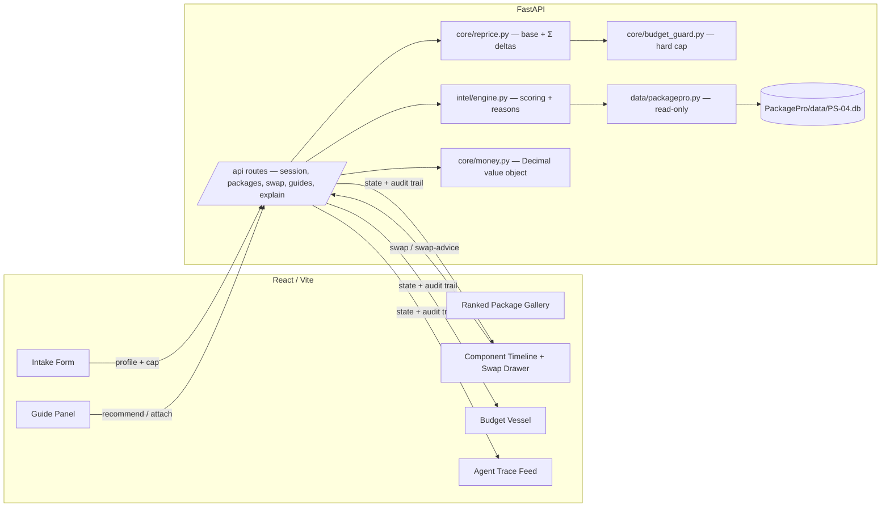

# PROJECT.md — PackagePro: Dynamic Tour Packages (PS-04)

> Read this before touching code. It's written so a new teammate *or* an AI
> assistant picking up this repo cold understands the thesis, the architecture
> and what to build next without asking anyone a question.

---

## 1. The one-sentence thesis

Most AI travel tools compete on **prettier itineraries**. We compete on
**trust**: an agent that scores real data, shows its reasoning, reprices in
exact decimal, and is *structurally incapable* of spending past the budget cap
you set — because the guardrail is enforced in code (`budget_guard.py`), not by
asking a model nicely.

Only ~8% of travelers currently trust AI to book on their behalf. That number is
the market gap. Every feature either (a) builds trust, or (b) doesn't ship.

The product metaphor is **liquid**: a dynamic package *flows and reshapes*, so
the UI shows fluidity as the evidence of dynamism. The budget is the vessel.

---

## 2. What's built (verified working)

- FastAPI backend, no external dependencies beyond FastAPI/Pydantic
- Deterministic scoring engine over the real `PS-04.db` (60 packages, real
  guides + availability) — **no LLM key required**
- `Money` value object: `Decimal` + ISO-4217, used end to end, never a float
- The repricer: `base + Σ(kept deltas)`, Decimal-exact, unit-tested
- Hard budget cap with a **structured refusal** (nothing charged, overage
  reported, 4 negotiation options offered) and an exportable **audit trail**
- Server-authoritative sessions — the client never owns a total
- Live component swapping with ranked, per-signal swap advice
- Language-aware (BCP-47) guide matching against real availability
- Price-factor explainer endpoint decomposing a price into its real factors
- Live agent trace (reasoning / tool calls / guard decisions)
- React + Vite frontend: intake → ranked gallery → customize (swap drawer,
  budget vessel, guide panel, trace feed); production build passes
- **64 unit tests passing** (money, repricing, budget guard)

Run it: see `SETUP.md`. Zero API keys.

---

## 3. System architecture



**Key invariant:** the server owns the total. Every cost-adding path — package,
swap, optional add-on, guide — flows through `BudgetGuard.add_cost()`. The
frontend is a view onto server state; it never computes a price.

---

## 4. Data model

Read-only, at `PackagePro/data/PS-04.db` (opened `mode=ro` — mutation is
structurally impossible). The layer in `data/packagepro.py` was written from
`PRAGMA table_info` on the live DB, not from the PDF — the previous build queried
nonexistent columns (`city_name`, `state_province`, `country_iso2`) and threw on
every query. Real columns: `name`, `state`, `country_code`.

| Table | Used for |
|---|---|
| `tour_packages` | package catalogue; `languages_offered`, `theme`, `tier`, `base_price` |
| `package_components` | the swappable/optional building blocks; `day_index`, `slot`, `swap_group`, `price_delta` |
| `tour_guides` | guide catalogue; BCP-47 `languages`, `specialisation`, `day_rate` |
| `guide_availability` | 3,600 rows — `is_available`, `slots_available`, `price_multiplier` |
| `price_history` | the factor decomposition behind `/explain/{id}` |
| `users` / `user_preferences` | `segment` (heavy/light/cold_start), `preferred_languages`, `accessibility_needs` |
| `itinerary_items` / `transfers` | carry `carbon_kg` — **not yet used** (see F4) |

Column names are not invented. If you add a query, `PRAGMA table_info` it first.

---

## 5. The money + guard invariants

1. **Money is `Decimal`, never `float`.** `core/money.py` is the only boundary.
   SQLite stores money as `TEXT` on purpose (NUMERIC affinity would corrupt
   `8500.00` → `8500.0`). Crossing the wire: `{amount: string, currency: string}`.
2. **The repricer is one function:** `base + Σ(kept non-optional deltas) +
   Σ(selected optional deltas)`. Never recompute a total anywhere else.
3. **`price_delta` is signed and can be negative.** A swap's cost is
   `to.price_delta − from.price_delta`, committed signed through the guard
   (a saving calls `remove_cost`).
4. **Over cap ⇒ nothing moves.** `add_cost` refuses, commits nothing, reports the
   overage and returns four structured negotiation options: approve a one-time
   overage, swap for a cheaper alternative, remove the item, or raise the cap
   (`raise_cap` is itself a logged decision).
5. **Every decision is appended to the audit trail** — this is the
   "how do you know it works" artifact for judges.

---

## 6. Feature inventory — the single source of truth

Status: `done` / `partial` / `todo`. Update this table as you work; do not keep a
second tracker.

| # | Feature | Category | Status | Notes |
|---|---|---|---|---|
| 1 | `Money` Decimal value object end to end | Foundation | done | `core/money.py` + `api/money.js`; 64 tests |
| 2 | Decimal-exact repricing (base + Σ deltas) | Foundation | done | `core/reprice.py` |
| 3 | Hard budget cap + audit trail | Core trust | done | `core/budget_guard.py`; refusal verified over-cap |
| 4 | Structured negotiation on refusal | Core trust | partial | guard returns 4 options; **no frontend gate UI yet** |
| 5 | Server-authoritative sessions | Core trust | done | `core/session.py`; in-memory (SQLite swap-in point) |
| 6 | Ranked packages with per-signal reasons | Differentiator | done | `intel/engine.py` + gallery cards |
| 7 | Honest cold-start labelling | Differentiator | done | `users.segment`; "declared preferences only" |
| 8 | Ranked swap advice | Core PS-04 | done | `/session/{id}/swap-advice/{component_id}` |
| 9 | Live component swapping | Core PS-04 | done | API + swap drawer; reprice verified |
| 10 | Optional add-ons | Core PS-04 | partial | API done (`add/remove_optional`); **no frontend UI** |
| 11 | Revert a swap | Core PS-04 | partial | API done (`unswap`); **no frontend UI** |
| 12 | Package gallery filtering | UI | partial | API done (`/packages` filters); frontend shows recommendations only |
| 13 | Language-aware guide matching (BCP-47) | Differentiator | done | real `guide_availability` gating |
| 14 | Guide availability heatmap | Differentiator | partial | API done (`on_date`); frontend uses one hardcoded date, no heatmap |
| 15 | Price-factor explainer (waterfall) | Differentiator | partial | `/explain/{id}` done; **no frontend UI** |
| 16 | Live agent trace | Transparency | done | feed renders reasoning/tool/decision lines |
| 17 | Multilingual UI (en/hi/ta/te) | Requirement | partial | `i18n/strings.js` complete; **not imported — dead code** |
| 18 | Confirm / cart step | Flow | todo | flow ends at `customize` |
| 19 | Carbon ledger (F4) | Differentiator | todo | data has `carbon_kg`; zero code yet |
| 20 | Accessibility-aware filtering (F6) | Inclusion | partial | `accessibility_needs` captured in profile; **not used to filter** |
| 21 | Seeded demo director (F7) | Demo resilience | todo | `?demo` mode + offline recorded run |
| 22 | Session persistence (SQLite/Postgres) | Production | todo | in-memory now; swap-in point marked |
| 23 | Auth + multi-user accounts | Production | todo | needed before preference memory |
| 24 | Real payment behind confirm | Production | todo | wire only inside a confirm endpoint |
| 25 | Optional LLM layer over the engine | Differentiator | todo | deterministic engine is primary by design |

---

## 7. Repo map

```
├── DESIGN.md                 visual system + feature blueprint
├── PROJECT.md                you are here
├── SETUP.md                  how to run it
├── .env.example              optional overrides (nothing required)
├── PackagePro/data/PS-04.db  the dataset — read-only by construction
├── docs/design_submission.md hackathon design submission
├── backend/
│   ├── requirements.txt      fastapi / uvicorn / pydantic / pytest
│   └── app/
│       ├── main.py                    FastAPI entrypoint (/health, /docs)
│       ├── api/routes.py              every HTTP endpoint
│       ├── core/
│       │   ├── money.py               Money(Decimal, ISO-4217)
│       │   ├── reprice.py             the repricer — start here for PS-04
│       │   ├── budget_guard.py        the trust-critical hard cap
│       │   └── session.py             server-authoritative session
│       ├── data/packagepro.py         read-only layer over PS-04.db
│       └── intel/engine.py            scoring, reasons, cold start
│   └── tests/                         money / reprice / budget_guard (64)
└── frontend/
    └── src/
        ├── App.jsx                    intake → packages → customize
        ├── api/{client,money}.js      fetch wrapper + client Money
        ├── components/                BudgetVessel · ComponentTimeline · TraceFeed
        └── i18n/strings.js            en/hi/ta/te (not yet wired)
```

---

## 8. Rules for whoever (human or AI) works on this next

1. **Never bypass `BudgetGuard`.** A new cost-adding step must call
   `guard.add_cost(...)`, never mutate a running total directly. Breaking this
   breaks the product.
2. **Money is never a float.** Use `Money` on both sides of the wire; cross as
   `{amount: string, currency: string}`. Animate money as string interpolation,
   never a JS `number`.
3. **Verify columns before querying.** `PRAGMA table_info` the live DB; the PDF
   and memory are not authoritative.
4. **The trace is not optional.** Any new operation appends to the session trace
   — if you can't state what it did in one sentence, it's doing too much.
5. **Keep the build green.** `cd backend && PYTHONPATH=. pytest tests/ -q` and
   `cd frontend && npm run build` must both pass before you stop.
6. **Update §6**, not a separate tracker — this file is the single source of
   truth so nobody has to hunt across chat history.
